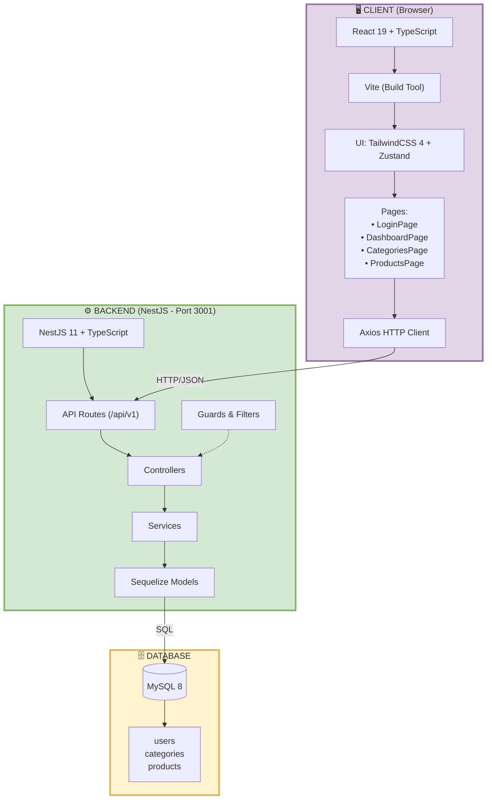
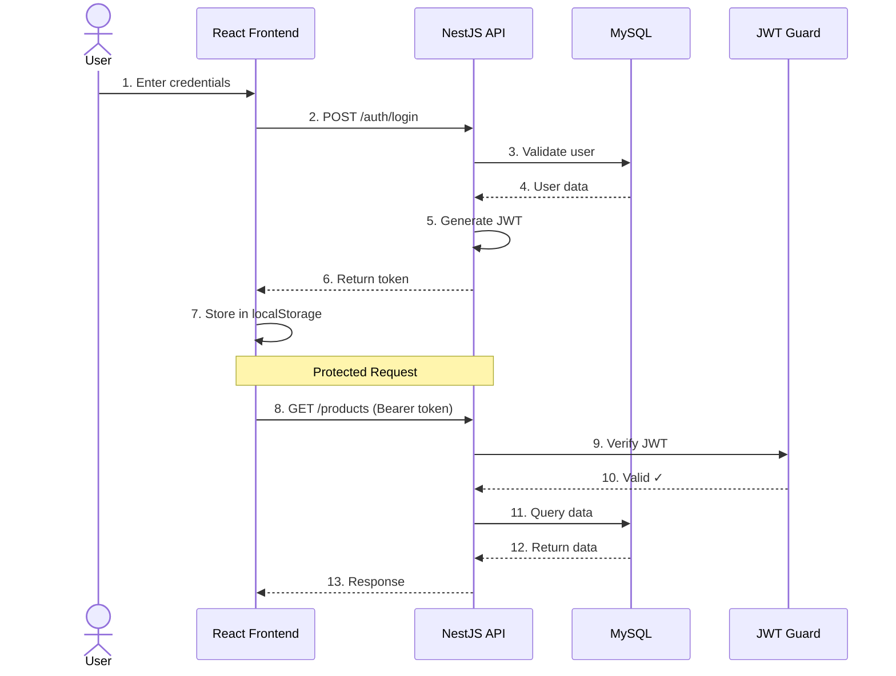
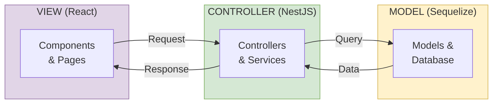
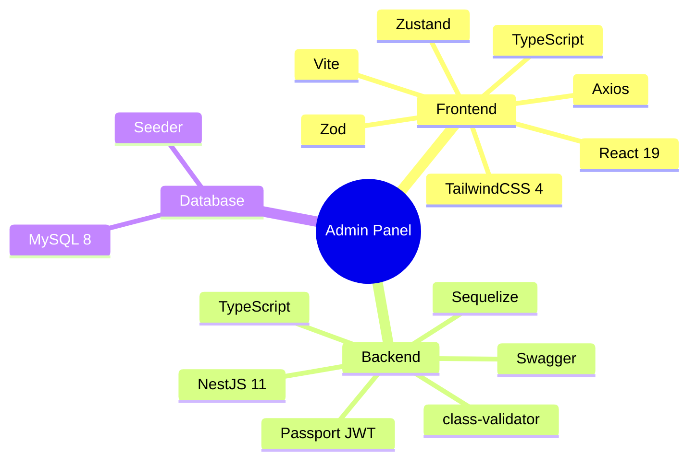

# DIAGRAM - Admin Panel Product Management System

> Diagram dalam format Mermaid - langsung bisa di-render di VS Code, GitHub, atau Draw.io

---

## 1. ERD (Entity Relationship Diagram) - Database Tables

### Cara Pakai:

**Di VS Code:**

- Install extension "Markdown Preview Mermaid Support"
- Preview file markdown ini (Ctrl+Shift+V)

**Di Draw.io:**

1. Buka [draw.io](https://app.diagrams.net/)
2. Klik **Arrange** → **Insert** → **Advanced** → **Mermaid**
3. Paste kode Mermaid di bawah
4. Klik **Insert**

**Di GitHub:**

- Langsung otomatis ter-render di README.md

### Diagram Mermaid:

```mermaid
erDiagram
    categories ||--o{ products : "has many"

    users {
        int id PK "Auto Increment"
        varchar(255) email UK "Unique"
        varchar(255) password
        varchar(100) name
        enum role "admin"
        boolean is_active
        datetime created_at
        datetime updated_at
    }

    categories {
        int id PK "Auto Increment"
        varchar(100) name
        text description
        boolean is_active
        datetime created_at
        datetime updated_at
    }

    products {
        int id PK "Auto Increment"
        int category_id FK
        varchar(200) name
        text description
        decimal(12,2) price
        int stock
        boolean is_active
        datetime created_at
        datetime updated_at
    }
```

**📖 Penjelasan ERD:**

**Relasi Database:**
- `categories` (1) ----< `products` (N) = **One-to-Many**
- Satu kategori bisa punya banyak produk
- Setiap produk harus punya kategori (via `category_id`)

**Table Users:**
- Admin yang bisa login ke sistem
- `email` sebagai username (unique)
- `password` di-hash dengan bcrypt
- `role` = 'admin' (hanya 1 role)

**Table Categories:**
- Kategori produk (Elektronik, Fashion, dll)
- `is_active` untuk soft delete
- Bisa dinonaktifkan tanpa hapus data

**Table Products:**
- Data produk dengan harga & stok
- `category_id` (FK) → wajib punya kategori
- `price` format DECIMAL(12,2) → Rp 10.000.000,50
- `is_active` untuk hide/show produk

**Contoh Data:**
```
Category: Elektronik (id=1)
  ├─ Laptop Asus (category_id=1, price=7000000)
  ├─ Mouse Logitech (category_id=1, price=150000)
  └─ Keyboard Mechanical (category_id=1, price=500000)

Category: Fashion (id=2)
  ├─ Kaos Polos (category_id=2, price=50000)
  └─ Celana Jeans (category_id=2, price=200000)
```

---

## 2. Arsitektur Sistem (System Architecture)



**📖 Penjelasan Arsitektur:**

**Alur Request → Response:**
```
Browser → React → Axios → NestJS → Sequelize → MySQL
                             ↓
                    Guards/Filters (Security)
```

**1️⃣ CLIENT (Browser):**
- **React 19**: Render UI components
- **Vite**: Build & compile TypeScript super cepat
- **TailwindCSS 4**: Styling utility-first
- **Zustand**: State management (login status, cart, dll)
- **Axios**: HTTP client untuk API calls
- User klik → trigger action → Axios kirim request

**2️⃣ BACKEND (NestJS - Port 3001):**
- **API Routes**: Base URL `/api/v1/*`
- **Guards & Filters**: 
  - JwtAuthGuard → Cek token valid
  - ValidationPipe → Validasi input
  - ExceptionFilter → Handle error
- **Controllers**: Handle HTTP request
- **Services**: Business logic
- **Models (Sequelize)**: ORM untuk query database

**3️⃣ DATABASE (MySQL 8):**
- Simpan semua data persistent
- 3 tables: users, categories, products

**Contoh Flow:**
```
User klik "Lihat Products"
  ↓
React: GET /api/v1/products (Header: Bearer token)
  ↓
NestJS Guard: Cek JWT valid? ✓
  ↓
Controller → Service → Model
  ↓
Query: SELECT * FROM products WHERE is_active = true
  ↓
MySQL return data → Model → Service → Controller
  ↓
Response JSON → Axios → React
  ↓
React render products list di UI
```

---

## 3. Authentication Flow



**📖 Penjelasan Authentication:**

**FASE 1: LOGIN (Step 1-7)**

```javascript
// 1-2: User submit form login
const login = async (email, password) => {
  const response = await axios.post('/api/v1/auth/login', {
    email: 'admin@example.com',
    password: 'password123'
  });
  
  // 3-4: Backend validasi
  // SELECT * FROM users WHERE email = 'admin@example.com'
  // bcrypt.compare(password, hashedPassword)
  
  // 5-6: Generate & return JWT
  // Response: {token: "eyJhbGc...", user: {...}}
  
  // 7: Simpan token
  localStorage.setItem('token', response.data.token);
  // Token contains: {userId: 1, email, role, exp}
}
```

**FASE 2: PROTECTED REQUEST (Step 8-13)**

```javascript
// 8: Request dengan token
const getProducts = async () => {
  const token = localStorage.getItem('token');
  
  const response = await axios.get('/api/v1/products', {
    headers: {
      Authorization: `Bearer ${token}` // Auto attach di Axios interceptor
    }
  });
  
  // 9-10: Backend verify JWT
  // jwt.verify(token, SECRET_KEY)
  // Token valid? → Extract user dari payload
  
  // 11-12: Query database
  // SELECT * FROM products
  
  // 13: Return data
  return response.data; // {success: true, data: [...]}
}
```

**Security:**
- Token expired dalam 24 jam
- Token disimpan di localStorage (bisa juga httpOnly cookie)
- Setiap request protected wajib kirim Bearer token
- Guard otomatis reject kalau token invalid/expired

---

## 4. MVC Pattern



**📖 Penjelasan MVC Pattern:**

**Separation of Concerns:**

**VIEW (React - Frontend):**
```tsx
// ProductsPage.tsx
function ProductsPage() {
  const [products, setProducts] = useState([]);
  
  const handleDelete = async (id) => {
    // Kirim request ke Controller
    await axios.delete(`/api/v1/products/${id}`);
    fetchProducts(); // Refresh data
  };
  
  return (
    <div>
      {products.map(p => (
        <ProductCard 
          key={p.id} 
          product={p}
          onDelete={handleDelete}
        />
      ))}
    </div>
  );
}
```

**CONTROLLER (NestJS - Backend):**
```typescript
// products.controller.ts
@Controller('products')
export class ProductsController {
  constructor(private productsService: ProductsService) {}
  
  @Delete(':id')
  async remove(@Param('id') id: number) {
    // Delegate ke Service (business logic)
    return this.productsService.remove(id);
  }
}

// products.service.ts
export class ProductsService {
  async remove(id: number) {
    // Cek apakah product exists
    const product = await this.productModel.findByPk(id);
    if (!product) throw new NotFoundException();
    
    // Soft delete (update is_active = false)
    await this.productModel.update(
      { is_active: false },
      { where: { id } }
    );
    
    return { success: true, message: 'Product deleted' };
  }
}
```

**MODEL (Sequelize - ORM):**
```typescript
// product.model.ts
@Table({ tableName: 'products' })
export class Product extends Model {
  @Column({ primaryKey: true, autoIncrement: true })
  id: number;
  
  @Column
  name: string;
  
  @Column({ type: DataType.DECIMAL(12, 2) })
  price: number;
  
  @ForeignKey(() => Category)
  @Column
  category_id: number;
  
  @BelongsTo(() => Category)
  category: Category;
}

// Auto generate query:
// UPDATE products SET is_active = false WHERE id = ?
```

**Keuntungan MVC:**
- **Maintainable**: Kode terpisah berdasarkan fungsi
- **Testable**: Bisa test Service tanpa Controller
- **Reusable**: Service bisa dipanggil dari berbagai Controller
- **Clear**: Setiap layer punya tanggung jawab jelas

---

## 5. Tech Stack



**📖 Penjelasan Tech Stack:**

**FRONTEND Stack:**

1. **React 19** - Library UI terbaru
   - Component-based architecture
   - Virtual DOM untuk performa
   - Hooks untuk state management
   
2. **TypeScript** - Type Safety
   ```typescript
   interface Product {
     id: number;
     name: string;
     price: number;
     category: Category;
   }
   // Compile-time error prevention
   ```

3. **Vite** - Build Tool
   - Dev server super cepat
   - Hot Module Replacement (HMR)
   - Lebih cepat dari Webpack

4. **TailwindCSS 4** - Utility-First CSS
   ```html
   <button className="bg-blue-500 hover:bg-blue-700 px-4 py-2 rounded">
     Submit
   </button>
   ```

5. **Zustand** - State Management
   ```typescript
   const useAuthStore = create((set) => ({
     user: null,
     login: (user) => set({ user }),
     logout: () => set({ user: null })
   }));
   ```

6. **Axios** - HTTP Client
   - Interceptors untuk auto-attach token
   - Better error handling
   - Request/response transformation

7. **Zod** - Schema Validation
   ```typescript
   const productSchema = z.object({
     name: z.string().min(3),
     price: z.number().positive()
   });
   ```

**BACKEND Stack:**

1. **NestJS 11** - Framework
   - Modular architecture
   - Dependency Injection
   - Built-in decorators (@Controller, @Service)

2. **Sequelize** - ORM
   - Type-safe queries
   - Migrations & seeders
   - Relationship handling

3. **Passport JWT** - Authentication
   - Strategy-based auth
   - Token generation & validation
   - Guard untuk protect routes

4. **Swagger** - API Documentation
   - Auto-generate docs dari code
   - Try-it-out features
   - Available at `/api/docs`

5. **class-validator** - DTO Validation
   ```typescript
   export class CreateProductDto {
     @IsString()
     @MinLength(3)
     name: string;
     
     @IsNumber()
     @Min(0)
     price: number;
   }
   ```

**DATABASE:**

1. **MySQL 8** - Relational Database
   - ACID compliance
   - Transactions support
   - Indexes untuk performa

2. **Seeder** - Initial Data
   - Admin user default
   - Sample categories & products
   - Run: `npm run seed`

**Kenapa Stack Ini?**

✅ **Modern**: Tech terbaru (React 19, NestJS 11, TailwindCSS 4)
✅ **Type-Safe**: TypeScript di FE & BE → less bugs
✅ **Maintainable**: Modular architecture, clean code
✅ **Scalable**: Bisa grow dari small ke large app
✅ **DevEx**: Good developer experience, fast dev server
✅ **Production-Ready**: Battle-tested technologies

---

## 📝 Catatan

**Keuntungan Mermaid:**

- ✅ Langsung render di VS Code (with extension)
- ✅ Otomatis render di GitHub/GitLab
- ✅ Bisa di-import ke Draw.io
- ✅ Lebih mudah dibaca & diedit
- ✅ Version control friendly

**Cara Pakai di Draw.io:**

1. Buka https://app.diagrams.net/
2. **Arrange** → **Insert** → **Advanced** → **Mermaid**
3. Paste kode Mermaid
4. Klik **Insert**

---

## 🔗 Resources

- [Mermaid Docs](https://mermaid.js.org/)
- [Mermaid Live Editor](https://mermaid.live/)

---

## 🎯 Contoh Flow Lengkap: "Tambah Product Baru"

**Step-by-step dari User sampai Database:**

```
1️⃣ USER ACTION
   User buka halaman Products → Klik "Tambah Product"

2️⃣ REACT (View)
   Form muncul dengan fields:
   - Name: "Laptop Asus ROG"
   - Category: "Elektronik" (dropdown dari API)
   - Price: 15000000
   - Stock: 5
   
   User klik "Submit"

3️⃣ VALIDATION (Frontend)
   Zod schema validate:
   ✓ name.length >= 3
   ✓ price > 0
   ✓ stock >= 0
   ✓ category_id valid

4️⃣ AXIOS REQUEST
   POST /api/v1/products
   Headers: {
     Authorization: "Bearer eyJhbGc...",
     Content-Type: "application/json"
   }
   Body: {
     name: "Laptop Asus ROG",
     category_id: 1,
     price: 15000000,
     stock: 5,
     description: "Gaming laptop"
   }

5️⃣ NESTJS - JWT GUARD
   @UseGuards(JwtAuthGuard)
   - Extract token dari header
   - Verify signature dengan SECRET_KEY
   - Decode payload → req.user = {id: 1, email: "admin@..."}
   - Token valid? ✓ Continue
   - Token invalid? ✗ Return 401 Unauthorized

6️⃣ NESTJS - CONTROLLER
   @Post()
   create(@Body() dto: CreateProductDto) {
     // DTO validation via class-validator
     return this.productsService.create(dto);
   }

7️⃣ NESTJS - SERVICE (Business Logic)
   async create(dto: CreateProductDto) {
     // Cek category exists?
     const category = await this.categoryModel.findByPk(dto.category_id);
     if (!category) throw new NotFoundException('Category not found');
     
     // Cek duplicate name?
     const exists = await this.productModel.findOne({
       where: { name: dto.name }
     });
     if (exists) throw new ConflictException('Product already exists');
     
     // Create product
     const product = await this.productModel.create({
       ...dto,
       is_active: true,
       created_at: new Date(),
       updated_at: new Date()
     });
     
     return product;
   }

8️⃣ SEQUELIZE MODEL
   Convert object → SQL:
   INSERT INTO products (
     name, category_id, price, stock, description,
     is_active, created_at, updated_at
   ) VALUES (
     'Laptop Asus ROG', 1, 15000000, 5, 'Gaming laptop',
     true, NOW(), NOW()
   )

9️⃣ MYSQL DATABASE
   - Execute query
   - Generate ID dengan AUTO_INCREMENT
   - Return: { id: 123, name: "Laptop Asus ROG", ... }

🔟 RESPONSE CHAIN
   Database → Model → Service → Controller → Transform Interceptor

   Response format:
   {
     success: true,
     message: "Product created successfully",
     data: {
       id: 123,
       name: "Laptop Asus ROG",
       category_id: 1,
       category: {
         id: 1,
         name: "Elektronik"
       },
       price: 15000000,
       stock: 5,
       is_active: true,
       created_at: "2026-02-07T10:30:00Z",
       updated_at: "2026-02-07T10:30:00Z"
     }
   }

1️⃣1️⃣ REACT (State Update)
   const response = await createProduct(formData);
   
   if (response.success) {
     // Update Zustand state
     setProducts([...products, response.data]);
     
     // Show success toast
     toast.success("Product berhasil ditambahkan!");
     
     // Redirect ke products list
     navigate('/products');
     
     // Product list auto refresh & show data baru
   }

1️⃣2️⃣ UI UPDATE
   Product list ter-render dengan data baru:
   
   [Elektronik] Laptop Asus ROG
   Rp 15.000.000 | Stock: 5
   [Edit] [Delete]
```

**Total Time: ~200ms**
- Frontend validation: 5ms
- Network request: 50ms
- Backend processing: 100ms
- Database query: 30ms
- Network response: 15ms

**Error Handling di Setiap Layer:**

```typescript
// Frontend
try {
  const response = await createProduct(data);
} catch (error) {
  if (error.response?.status === 401) {
    // Token expired → redirect to login
    navigate('/login');
  } else if (error.response?.status === 409) {
    // Duplicate product
    toast.error('Product sudah ada!');
  } else {
    toast.error('Terjadi kesalahan, coba lagi');
  }
}

// Backend
@Catch()
export class AllExceptionsFilter implements ExceptionFilter {
  catch(exception: unknown, host: ArgumentsHost) {
    const ctx = host.switchToHttp();
    const response = ctx.getResponse();
    
    if (exception instanceof HttpException) {
      return response.status(exception.getStatus()).json({
        success: false,
        message: exception.message,
        error: exception.name
      });
    }
    
    // Unexpected error
    return response.status(500).json({
      success: false,
      message: 'Internal server error'
    });
  }
}
```

**Logging:**
```
[2026-02-07 10:30:00] POST /api/v1/products
[2026-02-07 10:30:00] User ID: 1 | Email: admin@example.com
[2026-02-07 10:30:00] Query: INSERT INTO products (...)
[2026-02-07 10:30:00] Success | Response time: 195ms
```

Semua layer bekerja sama untuk satu tujuan: **Create Product secara aman, cepat, dan reliable!** 🚀

