# DIAGRAM - Admin Panel Product Management System

> Format Mermaid - langsung bisa di-render di VS Code, GitHub, dan Draw.io!

---

## 🎯 Cara Pakai

### ✅ Di VS Code (Recommended):

1. Install extension: **Markdown Preview Mermaid Support**
2. Buka file ini, tekan `Ctrl+Shift+V` untuk preview
3. Diagram langsung ter-render!

### ✅ Di GitHub:

- Langsung otomatis ter-render di README.md atau file .md apapun

### ✅ Di Draw.io:

1. Buka [draw.io](https://app.diagrams.net/)
2. Klik **Arrange** → **Insert** → **Advanced** → **Mermaid**
3. Copy-paste kode Mermaid di bawah
4. Klik **Insert**

---

## 1. ERD (Entity Relationship Diagram) - Database Tables

```mermaid
erDiagram
    categories ||--o{ products : "has many"

    users {
        int id PK "Auto Increment"
        varchar(255) email UK "Unique"
        varchar(255) password
        varchar(100) name
        enum role "admin"
        boolean is_active
        datetime created_at
        datetime updated_at
    }

    categories {
        int id PK "Auto Increment"
        varchar(100) name
        text description
        boolean is_active
        datetime created_at
        datetime updated_at
    }

    products {
        int id PK "Auto Increment"
        int category_id FK
        varchar(200) name
        text description
        decimal(12,2) price
        int stock
        boolean is_active
        datetime created_at
        datetime updated_at
    }
```

**Keterangan:**

- 🔑 PK = Primary Key (Auto Increment)
- 🔗 FK = Foreign Key
- UK = Unique Key
- `categories` → `products` = One to Many relationship

---

## 2. Arsitektur Sistem (System Architecture)

```mermaid
flowchart TB
    subgraph CLIENT["🖥️ CLIENT (Browser)"]
        direction TB
        REACT["React 19 + TypeScript"]
        VITE["Vite (Build Tool)"]
        UI["UI Libraries:<br/>TailwindCSS 4 + Zustand"]
        AXIOS["Axios HTTP Client"]
        PAGES["Pages:<br/>• LoginPage<br/>• DashboardPage<br/>• CategoriesPage<br/>• ProductsPage<br/>• DetailPages"]

        REACT --> VITE
        VITE --> UI
        UI --> PAGES
        PAGES --> AXIOS
    end

    subgraph BACKEND["⚙️ BACKEND (NestJS Server - Port 3001)"]
        direction TB
        NESTJS["NestJS 11 + TypeScript"]
        API["API Routes (/api/v1)"]
        CONTROLLER["Controllers<br/>(Routes/Endpoints)"]
        SERVICE["Services<br/>(Business Logic)"]
        MODEL["Sequelize Models<br/>(ORM)"]
        MIDDLEWARE["Middleware/Guards:<br/>• JwtAuthGuard<br/>• ValidationPipe<br/>• ExceptionFilter<br/>• TransformInterceptor"]

        NESTJS --> API
        API --> CONTROLLER
        CONTROLLER --> SERVICE
        SERVICE --> MODEL
        MIDDLEWARE -.->|Protect| CONTROLLER
    end

    subgraph DATABASE["🗄️ DATABASE"]
        direction TB
        MYSQL[("MySQL 8")]
        TABLES["Tables:<br/>• users<br/>• categories<br/>• products"]
        SEEDER["Seeder:<br/>Admin user + demo data"]

        MYSQL --> TABLES
        SEEDER -.->|Initialize| MYSQL
    end

    AXIOS -->|"HTTP/JSON<br/>(REST API)"| API
    MODEL -->|"SQL Queries"| MYSQL

    style CLIENT fill:#e1d5e7,stroke:#9673a6,stroke-width:3px
    style BACKEND fill:#d5e8d4,stroke:#82b366,stroke-width:3px
    style DATABASE fill:#fff2cc,stroke:#d6b656,stroke-width:3px
```



---

## 3. Authentication Flow

```mermaid
sequenceDiagram
    actor User
    participant Frontend as React Frontend
    participant Backend as NestJS API
    participant DB as MySQL Database
    participant Guard as JWT Guard

    User->>Frontend: 1. Enter credentials
    Frontend->>Backend: 2. POST /api/v1/auth/login<br/>{email, password}
    Backend->>DB: 3. Validate user
    DB-->>Backend: 4. User data
    Backend->>Backend: 5. Generate JWT token
    Backend-->>Frontend: 6. Return {token, user}
    Frontend->>Frontend: 7. Store token in localStorage

    Note over Frontend,Backend: Subsequent Requests

    Frontend->>Backend: 8. GET /api/v1/products<br/>Header: Bearer {token}
    Backend->>Guard: 9. Verify JWT
    Guard-->>Backend: 10. Token valid ✓
    Backend->>DB: 11. Query products
    DB-->>Backend: 12. Products data
    Backend-->>Frontend: 13. Return products
    Frontend->>User: 14. Display data
```



---

## 4. MVC Pattern


---

## 5. Folder Structure


---

## 6. Tech Stack Summary


---

## 7. API Endpoints


---

## 8. Component Hierarchy (Frontend)


---

## 📋 Catatan

- **Mermaid** lebih mudah dibaca dan diedit dibanding XML
- Otomatis ter-render di GitHub, VS Code, dan GitLab
- Bisa juga di-import ke Draw.io jika perlu
- Lebih maintainable dan version-control friendly
- Support berbagai jenis diagram: ERD, Flowchart, Sequence, Mindmap, dsb.

---

## 🔗 Resources

- [Mermaid Documentation](https://mermaid.js.org/)
- [Mermaid Live Editor](https://mermaid.live/)
- [Draw.io](https://app.diagrams.net/)
